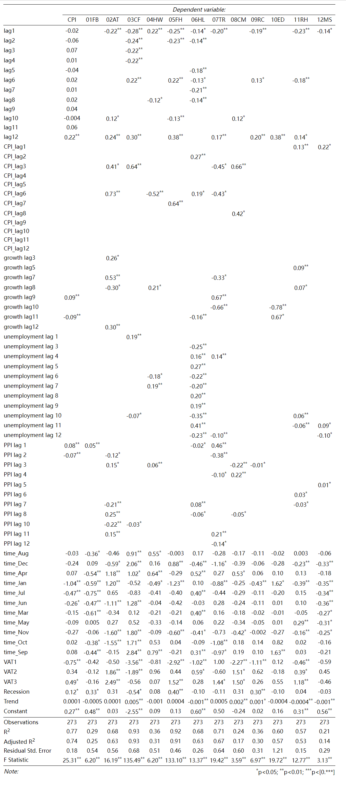

```{r setup, include=FALSE}
knitr::opts_chunk$set(echo = TRUE)
```

```{r rm, include=FALSE}
 rm(list = ls())
Sys.setlocale("LC_TIME", "English")
```

```{r Library, include=FALSE}
#Packages
library(readxl)
library(data.table)
library(lubridate)#extract cpi time to newdata(furniture48)
library(tidyverse)
library(broom)
library(stargazer)
library(knitr)
library(officer)
library(flextable)
library(magrittr)
library(dplyr)
library(moments)
library(Inflation)
library(ggplot2)
library(zoo)
library(xts)
library(hydroTSM)
library(openair)
library(tibble)
library(miscTools)
library(priceR)
library(Metrics)
library(sjPlot)
library(sjmisc)
library(sjlabelled)
library(kableExtra)
library(gridExtra)
library(egg)
library(grid)
library(cowplot)
library(spatstat)#shift有重复
library(SciViews)
library(sos)
library(nowcasting)
library("gridExtra")
library(tseries)
library(tinytex)
library(modelsummary)
library(flextable)
library(dplyr)
library(formatR)


```

```{r language,message=FALSE, warning=FALSE, include=FALSE, paged.print=FALSE}
Sys.setlocale("LC_TIME","English")
```


```{r eval=FALSE, include=FALSE}
cpi1 <-
  read_xls("cpi data/consumerpriceinflationdetailedreferencetables (1).xls",
           "Table 57")
colnames(cpi1) <- cpi1[6,]

cpi2 <- cpi1[-c(1:6), c(1, 3)]
cpi2[, 2] <- as.numeric(cpi2$`CPI ALL ITEMS`)

growth_rate <- function(x)
  (x / lag(x) - 1) * 100
cpi2$growth <- growth_rate(cpi2$`CPI ALL ITEMS`)

u_i <- newdata[, 1]
u_i$time <- newdata$time1
colnames(u_i)[3] <- c("Inflation")
cpi2$time1 <-
  seq.Date(
    from = as.Date("1988/01/01", format = "%Y/%m/%d"),
    by = "month",
    length.out = 395
  )


q <- ggplot(data = cpi2, aes(x = time1)) +
  geom_line(aes(y = growth, color = "Inflation(Monthly)")) +
  labs(x = "Time", y = "percent change")
q
```

```{r annual ppi and cpi,include=FALSE}
annual_cpi <- read_xls("series-130522 (3).xls")

MAR97 <- which(annual_cpi$Title == "1997 MAR")
NOV2019 <- which(annual_cpi$Title == "2019 NOV")

cpi_97_19 <- annual_cpi[c(MAR97:NOV2019), ]
cpi_97_19$`CPI ANNUAL RATE 00: ALL ITEMS 2015=100` <-
  as.numeric(cpi_97_19$`CPI ANNUAL RATE 00: ALL ITEMS 2015=100`)

ppi <- read_xls("series-130522 (2).xls")

MAR96_ppi <- which(ppi$Title == "1996 MAR")
NOV2019_ppi <- which(ppi$Title == "2019 NOV")

ppi_96_19 <- ppi[c(MAR96_ppi:NOV2019_ppi), ]
ppi_96_19$`Manufactured Products for Domestic Market, Excl Duty` <-
  as.numeric(ppi_96_19$`Manufactured Products for Domestic Market, Excl Duty`)

annual_change <- function(x)
  ((x / lag(x, 12)) - 1) * 100
ppi_96_19$ppi_inflation <-
  annual_change(ppi_96_19$`Manufactured Products for Domestic Market, Excl Duty`)

ppi_cpi <- cbind(cpi_97_19[, c(2)], ppi_96_19[-c(1:12), 3])

ppi_cpi$time1 <-
  seq.Date(
    from = as.Date("1997/03/01", format = "%Y/%m/%d"),
    by = "month",
    length.out = 273
  )
colnames(ppi_cpi) <- c("cpi", "ppi", "time1")
```

# Changes in the persistence of the CPI and the PPI

The data set is Consumer price inflation (CPI) all items and Producer price inflation(PPI) for the UK from March 1997 to November 2019. Figure \@ref(fig:Annualinflation) and \@ref(fig:acd) plot the UK annual and monthly CPI and PPI. To analyze persistent changes in CPI and PPI, the first step is to determine their basic time series properties. Determining the sequence of data integration is of particular importance. That is, evaluating whether the PPI and CPI inflation rates are  I (0) processes. If the inflation rate is a non-stationary I(1) process, then the price level will be an I(2) process, so the analysis to determine the pass-through of producer price shocks to consumer prices will be more complex.

```{r Annualinflation, echo=FALSE, fig.cap="UK Annual inflation: CPI vs PPI", fig.topcaption=TRUE, message=FALSE, warning=FALSE,results='asis'}
q <- ggplot(data = ppi_cpi, aes(x = time1)) +
  geom_line(aes(y = cpi, color = "CPI")) +
  geom_line(aes(y = ppi, color = "PPI")) +
  labs(x = "", y = "")
q

```

```{r Monthly CPI and PPI inflation, include=FALSE}
monthly_cpi_index <- read_xls("series-130522 (4).xls")

monthly_cpi_index[, 2] <-
  as.numeric(monthly_cpi_index$`CPI INDEX 00: ALL ITEMS 2015=100`)
month_change <- function(x)
  ((x / lag(x)) - 1) * 100

monthly_cpi_index$`CPI INDEX 00: ALL ITEMS 2015=100` <-
  month_change(monthly_cpi_index$`CPI INDEX 00: ALL ITEMS 2015=100`)

MAR96_cpi_monthly <- which(monthly_cpi_index$Title == "1996 MAR")
NOV2019_cpi_monthly <- which(monthly_cpi_index$Title == "2019 NOV")

monthly_cpi_96_19 <-
  monthly_cpi_index[c(MAR96_cpi_monthly:NOV2019_cpi_monthly), ]

#monthly change ppi
ppi$ppi_numerical <-
  as.numeric(ppi$`Manufactured Products for Domestic Market, Excl Duty`)
ppi$ppi_month_change <- month_change(ppi$ppi_numerical)

MAR96_ppi_monthly <- which(ppi$Title == "1996 MAR")
NOV2019_ppi_monthly <- which(ppi$Title == "2019 NOV")

monthly_ppi_96_19 <- ppi[c(MAR96_ppi_monthly:NOV2019_ppi_monthly), ]

monthly_ppi_cpi <-
  cbind(monthly_cpi_96_19[-c(1:12), 2], monthly_ppi_96_19$ppi_month_change[-c(1:12)])
monthly_ppi_cpi$time1 <-
  seq.Date(
    from = as.Date("1997/03/01", format = "%Y/%m/%d"),
    by = "month",
    length.out = 273
  )
colnames(monthly_ppi_cpi) <- c("cpi", "ppi", "time1")

```


```{r acd, echo=FALSE, fig.cap="UK Monthly CPI and PPI inflation", fig.topcaption=TRUE, message=FALSE, warning=FALSE,results='asis'}
ggp1 <- ggplot(data = monthly_ppi_cpi, aes(x = time1)) +
  geom_line(aes(y = cpi, color = "CPI")) +
  labs(x = "", y = "")

ggp2 <- ggplot(data = monthly_ppi_cpi, aes(x = time1)) +
  geom_line(aes(y = ppi, color = "PPI")) +
  labs(x = "", y = "")


title <-
  ggdraw() + draw_label("UK Monthly CPI and PPI inflation", fontface = 'bold')

plot_grid(title, ggp1, ggp2, ncol = 1, align = 'v') 
```

Another test we can conduct is the Augmented Dickey–Fuller (ADF) t-statistic test to find if the series has a unit root (a series with a trend line will have a unit root and result in a large p-value).
ADF tests reject the null of non-stationarity of both PPI and CPI. The test identifies all stationary periods within the sample.
The period identified as I(0) can be analysed according to the timing and operating rules of monetary policy.

```{r stationary, echo=FALSE}
options(warn = -1)
adf.test(monthly_ppi_cpi$cpi)
adf.test(monthly_ppi_cpi$ppi) 
```

\newpage

# Methodology to evaluate the predictive content of the PPI for the CPI

Compared with all the previous variables, we used the following formula estimated by Ordinary least squares (OLS). We use Stepwise regression to simplify the results.

$$
\begin{aligned}
	\pi _t=&\pi +\,\,\mathrm{Trend}_t+\beta _1D_{Jan}+....+\beta _{11}D_{Dec}+\beta _{12}D_{\mathrm{recesion}}+\\
	&\beta _{13}D_{VAT_1}+\beta _{14}D_{VAT_2}+\beta _{15}D_{TAT_3}+\sum_{j=1}^{12}{\psi _j}U_{t-j}+\sum_{j=1}^{12}{\alpha _j}\pi _{t-j}+\sum_{j=1}^{12}{\lambda _j}CPI_{t-j}+\sum_{j=1}^{12}{\theta _j}C _{t-j}+\sum_{j=1}^{12}{\zeta _j}\pi^{PPI} _{t-j}+\sigma _t\\
\end{aligned}
$$
Where $\pi$ is the inflation for each divisions, $D_{JAN}$   to $D_{Dec}$   are eleven dummy variables for each month. We define February as the base category against which the others are assessed to avoid the dummy variable trap. $D_{recession}$  , the great recession that officially began in April 2008 and ended in June 2009, $D_{VAT_1}$ ,  $D_{VAT_2}$ and $D_{VAT_3}$    are three Value-add ed tax change in the United Kingdom, which were  December 2008, January 2010 and January 2011.
$\sum_{j=1}^{12}{\psi _j}U_{t-j}$ describe the unemployment rate.
$\sum_{j=1}^{12}{\alpha _j}\pi _{t-j}$ is the sum of twelve months lagged inflation dependent variables.

$\sum_{i=1}^{12}{\lambda _i}CPI_{t-i}$ represents the sum of twelve months lags of the inflation rate of CPI ALL ITEMS and 

$\sum_{k=1}^{12}{\theta _k}C _{t-k}$    is the sum of 12 monthly lags consumption growth rate. 
$\sum_{j=1}^{12}{\zeta _j}\pi^{PPI} _{t-j}$ is PPI inflation.

Please see figure \@ref(fig:bar3) for results.

```{r message=FALSE, warning=FALSE, include=FALSE, paged.print=FALSE}
cpi <- read_excel("cpi data/cpi+division+group.xlsx")

setDF(cpi)#convert to 'data.frame'
#读取consumption growth rate 数据
raw_growth <-
  read.csv("monthly consumption data and growth rate 97.3 - 19.11.csv")
cpi$growth <- c(rep(0, 110), raw_growth$growth_rate, rep(0, 4))
#读取unemployed rate
raw_unemployment <- read_excel("unemployment rate 97.3-19.11.xlsx")
cpi$unemployment <-
  c(rep(0, 110), raw_unemployment$`Unemployment rate`, rep(0, 4))
growth_rate <- function(x)
  (x / lag(x) - 1) * 100
cpi$unemployment_growth <- growth_rate(cpi$unemployment)
#read ppi
cpi$ppi <- c(rep(0, 110), ppi_cpi$ppi, rep(0, 4))
#
cols.num <- c(colnames(cpi))
cpi[cols.num] <- sapply(cpi[cols.num], as.numeric)
#sapply(cpi,class)

cpi <- as.data.table(cpi)
colnames(cpi) = gsub("&", "and", colnames(cpi))
#class(cpi$`REPAIR OF HOUSEHOLD APPLIANCES1`)
COPY <- copy(cpi)
tracemem(COPY) == tracemem(cpi)


Data_A = as.data.table (cpi)
#


#
Varnames <- copy(names(Data_A))
Data_A[, (names(Data_A)) := lapply(.SD, as.numeric)][,
                                                     rn := .I]
melted <- melt(Data_A, id.vars = "rn")[,
                                       (paste0("lag_", 0:12)) := data.table::shift(value, 0:12, type =
                                                                                     "lag"),
                                       by = variable][,
                                                      value := NULL][]
res <-
  dcast.data.table(melt(
    melted,
    id.vars = c("rn", "variable"),
    variable.name = "lag"
  ),
  rn ~ variable + lag,
  sum)

#view results
res[, ncol(res), with = FALSE]
# lagged variable generation ----------------------------------------------


cpi <-
  cpi[, unlist(lapply(.SD, data.table::shift, n = 0:12), recursive = FALSE)]#lags generation


# Monthly Dummies ---------------------------------------------------------


cpi$time <-
  seq.Date(
    from = as.Date("1988/01/01", format = "%Y/%m/%d"),
    by = "month",
    length.out = 387
  )
cpi$time <- format(cpi$time, format = "%b")
Sys.setlocale("LC_TIME", "English")
cpi <-
  fastDummies::dummy_cols(cpi,
                          select_columns = "time",
                          remove_most_frequent_dummy = TRUE,)
cpi$time1 <-
  seq.Date(
    from = as.Date("1988/01/01", format = "%Y/%m/%d"),
    by = "month",
    length.out = 387
  )
#


# Extract time from 1993-2019 ---------------------------------------------


#I would recommend when you do the regressions, you leave out December 2019, because it is impacted by the Covid effect in 2020 Q1. Otherwise good to go!

newdata <-
  with(cpi, cpi[(time1) >= "1997-03-01" & (time1) <= "2019-11-01",])

Trend <- seq_along(newdata$time1)


# deal with copy ----------------------------------------------------------


COPY$time1 <-
  seq.Date(
    from = as.Date("1988/01/01", format = "%Y/%m/%d"),
    by = "month",
    length.out = 387
  )
COPY <-
  with(COPY, COPY[(time1) >= "1997-03-01" &
                    (time1) <= "2019-11-01",])

COPY = subset(COPY, select = -c(time1))
#lag
```


```{r Lag and VAT, include=FALSE}
old13 <- c(2:13)
for (i in 1:12) {
  assign(paste0("lag", i), select(newdata, ends_with(paste0(old13[i]))))
  
}
lag1 <- lag1 %>% select(-contains("12"))
lag2 <- lag2 %>% select(-contains("13"))
VAT1 <- as.numeric(newdata$`time1` == "2008-12-01")
VAT2 <- as.numeric(newdata$`time1` == "2010-01-01")
VAT3 <- as.numeric(newdata$`time1` == "2011-01-01")
Recession <-
  as.numeric(newdata$`time1` >= "2008-04-01" &
               newdata$`time1` <= "2009-06-01")
```


```{r MONTYHLY DUMMIES, include=FALSE}
monthname <-
  c(
    "time_Apr",
    "time_Aug",
    "time_Dec",
    "time_Jan",
    "time_Jul",
    "time_Jun" ,
    "time_Mar",
    "time_May",
    "time_Nov",
    "time_Oct",
    "time_Sep"
  )
for (i in 1:length(monthname)) {
  print(which(colnames(newdata) == monthname[i]))
}
```


```{r Create time_Apr etc., include=FALSE}
#the correct version. 首先把月度虚拟变量存储到cpilag 里.
#然后用同一迭代变量 送到各自的time_下. **注意, 双迭代变量还未完全掌握, i
#和j 一起用 必出错**

#nan inf 替换成0
is.na(newdata) <- sapply(newdata, is.infinite)#把所有inf变成0
newdata[is.na(newdata)] <- 0

consumption_s <- which(colnames(newdata) == "growth1")
consumption_cover <- consumption_s:(consumption_s + 12)
consumption <- newdata[, consumption_s:(consumption_s + 12)]
#consumption<-newdata[,2250:2262]

monthdummies_s <- which(colnames(newdata) == "time_Apr")
monthdummies_s_cover <- monthdummies_s:(monthdummies_s + 10)
monthdummies <-
  newdata[, monthdummies_s_cover:(monthdummies_s_cover + 10)]

unemployment1_s <- which(colnames(newdata) == "unemployment1")
unemployment1_s_cover <- unemployment1_s:(unemployment1_s + 12)
unemployment <-
  newdata[, unemployment1_s_cover:(unemployment1_s_cover + 12)]

unemployment1_s_g <- which(colnames(newdata) == "unemployment_growth1")
unemployment1_s_g_cover <- unemployment1_s_g:(unemployment1_s_g + 12)
unemployment_growth <-
  newdata[, unemployment1_s_g_cover:(unemployment1_s_g_cover + 12)]
#monthdummies<-newdata[,2264:2274]

ppi_s <- which(colnames(newdata) == "ppi1")
ppi_s_g_cover <- ppi_s:(ppi_s + 12)
ppi_ <- newdata[, ppi_s_g_cover:(ppi_s_g_cover + 12)]


for (i in 1:13) {
  assign(colnames(consumption)[i], as.numeric(unlist(consumption[[i]])))
}


for (i in 1:11) {
  assign(colnames(monthdummies)[i], as.numeric(unlist(monthdummies[[i]])))
}

for (i in 1:13) {
  assign(colnames(unemployment)[i], as.numeric(unlist(unemployment[[i]])))
}

for (i in 1:13) {
  assign(colnames(unemployment_growth)[i], as.numeric(unlist(unemployment_growth[[i]])))
}

for (i in 1:13) {
  assign(colnames(ppi_)[i], as.numeric(unlist(ppi_[[i]])))
}

```

```{r simply lag and cpi, include=FALSE}

## CPI LDV variables position

lag.list <- mget(paste0("lag", 1:12))


for (i in 1:12) {
  assign(paste0("lag", i), as.data.frame(lag.list[[i]]))
}

COPY <- as.data.frame(COPY)


# CPI-LAGS ----------------------------------------------------------------
cpi.list <- c(paste0("CPI ALL ITEMS", 2:13))

for (i in 1:length(cpi.list)) {
  print(which(colnames(newdata) == cpi.list[i]))
  
}
cpilag <- newdata[, 2:13]
for (i in 1:12) {
  assign(paste0("CPI_lag", i), as.numeric(unlist(cpilag[, ..i])))
  
}


```


```{r include=FALSE}
# function ----------------------------------------------------------------


# Automated model selection
# Author      : Joris Meys
# version     : 0.2
# date        : 12/01/09

#CHANGE LOG
# 0.2   : check for empty scopevar vector

# #CHANGE LOG -------------------------------------------------------------


# Function has.interaction checks whether x is part of a term in terms
# terms is a vector with names of terms from a model
has.interaction <- function(x,terms){
  out <- sapply(terms,function(i){
    sum(1-(strsplit(x,":")[[1]] %in% strsplit(i,":")[[1]]))==0
  })
  return(sum(out)>0)
}

# Function Model.select
# model is the lm object of the full model
# keep is a list of model terms to keep in the model at all times
# sig gives the significance for removal of a variable. Can be 0.1 too (see SPSS)
# verbose=T gives the F-tests, dropped var and resulting model after 
model.select <- function(model,keep,sig=0.05,verbose=F){
  counter=1
  # check input
  if(!is(model,"lm")) stop(paste(deparse(substitute(model)),"is not an lm object\n"))
  # calculate scope for drop1 function
  terms <- attr(model$terms,"term.labels")
  if(missing(keep)){ # set scopevars to all terms
    scopevars <- terms
  } else{            # select the scopevars if keep is used
    index <- match(keep,terms)
    # check if all is specified correctly
    if(sum(is.na(index))>0){
      novar <- keep[is.na(index)]
      warning(paste(
        c(novar,"cannot be found in the model",
          "\nThese terms are ignored in the model selection."),
        collapse=" "))
      index <- as.vector(na.omit(index))
    }
    scopevars <- terms[-index]
  }
  
  # Backward model selection : 
  
  while(T){
    # extract the test statistics from drop.
    test <- drop1(model, scope=scopevars,test="F")
    
    if(verbose){
      cat("-------------STEP ",counter,"-------------\n",
          "The drop statistics : \n")
      print(test)
    }
    
    pval <- test[,dim(test)[2]]
    
    names(pval) <- rownames(test)
    pval <- sort(pval,decreasing=T)
    
    if(sum(is.na(pval))>0) stop(paste("Model",
                                      deparse(substitute(model)),"is invalid. Check if all coefficients are estimated."))
    
    # check if all significant
    if(pval[1]<sig) break # stops the loop if all remaining vars are sign.
    
    # select var to drop
    i=1
    while(T){
      dropvar <- names(pval)[i]
      check.terms <- terms[-match(dropvar,terms)]
      x <- has.interaction(dropvar,check.terms)
      if(x){i=i+1;next} else {break}              
    } # end while(T) drop var
    
    if(pval[i]<sig) break # stops the loop if var to remove is significant
    
    if(verbose){
      cat("\n--------\nTerm dropped in step",counter,":",dropvar,"\n--------\n\n")              
    }
    
    #update terms, scopevars and model
    scopevars <- scopevars[-match(dropvar,scopevars)]
    terms <- terms[-match(dropvar,terms)]
    
    formul <- as.formula(paste(".~.-",dropvar))
    model <- update(model,formul)
    
    if(length(scopevars)==0) {
      warning("All variables are thrown out of the model.\n",
              "No model could be specified.")
      return()
    }
    counter=counter+1
  } # end while(T) main loop
  return(model)
}

```

```{r regression, include=FALSE}
regression <-
  lapply(1:173, function(x)
    lm(
      COPY[, x] ~ lag1[, x] + lag2[, x] + lag3[, x] + lag4[, x] +
        lag5[, x] + lag6[, x] + lag7[, x] +
        lag8[, x] + lag9[, x] +
        lag10[, x] + lag11[, x] + lag12[, x] +
        CPI_lag1 + CPI_lag2 + CPI_lag3 +
        CPI_lag4 + CPI_lag5 + CPI_lag6 + CPI_lag7 +
        CPI_lag8 + CPI_lag9 + CPI_lag10 +
        CPI_lag11 + CPI_lag12
      + time_Aug +  time_Dec + time_Apr + time_Jan +
        time_Jul + time_Jun +
        time_Mar + time_May + time_Nov +
        time_Oct + time_Sep + VAT1 + VAT2 + VAT3 + Recession + Trend
      + growth2 + growth3 + growth4 +
        growth5 + growth6 + growth7 + growth8 + growth9 + growth10 + growth11 +
        growth12 + growth13
      + unemployment2 + unemployment3 +
        unemployment4 + unemployment5 + unemployment6 + unemployment7 + unemployment8 +
        unemployment9 + unemployment10 + unemployment11 + unemployment12 + unemployment13
      + ppi2 + ppi3 + ppi4 + ppi5 +
        ppi6 + ppi7 + ppi8 + ppi9 + ppi10 + ppi11 + ppi12 + ppi13
    ))
for (i in 1:122) {
  names(regression[[i]]$coefficients) <-
    c(
      'Constant',
      'lag1',
      'lag2',
      "lag3",
      "lag4",
      "lag5",
      "lag6",
      "lag7",
      "lag8",
      "lag9",
      "lag10",
      "lag11",
      "lag12",
      "CPI_lag1",
      "CPI_lag2",
      "CPI_lag3",
      "CPI_lag4",
      "CPI_lag5",
      "CPI_lag6",
      "CPI_lag7",
      "CPI_lag8",
      "CPI_lag9",
      "CPI_lag10",
      "CPI_lag11",
      "CPI_lag12",
      "time_Aug" ,
      "time_Dec",
      "time_Feb",
      "time_Jan",
      "time_Jul",
      "time_Jun" ,
      "time_Mar",
      "time_May",
      "time_Nov",
      "time_Oct",
      "time_Sep",
      "VAT1",
      "VAT2",
      "VAT3",
      "Recession",
      "Trend",
      "growth lag1",
      "growth lag2",
      "growth lag3",
      "growth lag4",
      "growth lag5",
      "growth lag6",
      "growth lag7",
      "growth lag8",
      "growth lag9",
      "growth lag10",
      "growth lag11",
      "growth lag12",
      "unemployment lag 1",
      "unemployment lag 2",
      "unemployment lag 3",
      "unemployment lag 4",
      "unemployment lag 5",
      "unemployment lag 6",
      "unemployment lag 7",
      "unemployment lag 8",
      "unemployment lag 9",
      "unemployment lag 10",
      "unemployment lag 11",
      "unemployment lag 12",
      "PPI lag 1",
      "PPI lag 2",
      "PPI lag 3",
      "PPI lag 4",
      "PPI lag 5",
      "PPI lag 6",
      "PPI lag 7",
      "PPI lag 8",
      "PPI lag 9",
      "PPI lag 10",
      "PPI lag 11",
      "PPI lag 12"
    )
}
```


```{r keep critial, include=FALSE}

div.name <-
  c(
    "CPI ALL ITEMS",
    "FOOD AND NON-ALCOHOLIC BEVERAGES",
    "ALCOHOLIC BEVERAGES AND TOBACCO",
    "CLOTHING AND FOOTWEAR",
    "HOUSING, WATER, ELELCTRICITY, GAS AND OTHER FUELS",
    "FURNITURE, HOUSEHOLD EQUIPMENT AND MAINTENANCE",
    "HEALTH",
    "TRANSPORT",
    "COMMUNICATION",
    "RECREATION and CULTURE",
    "EDUCATION",
    "RESTAURANTS AND HOTELS",
    "MISCELLANEOUS GOODS AND SERVICES"
  )

#division 位置
div.poi <- vector()

for (i in 1:length(div.name)) {
  div.poi[i] <-  which(colnames(COPY) == div.name[i])
  
}

div.reg <- regression[div.poi]


slr.total <- list()
keep.dummies <- c(
  "time_Aug",
  "time_Apr",
  "time_Dec",
  "time_Jan",
  "time_Jul",
  "time_Jun" ,
  "time_Mar",
  "time_May",
  "time_Nov",
  "time_Oct",
  "time_Sep",
  "VAT1",
  "VAT2",
  "VAT3",
  "Recession",
  "Trend"
)
for (i in 1:length(div.reg)) {
  slr.total[[i]] <-
    model.select(div.reg[[i]],
                 keep = keep.dummies,
                 sig = 0.05,
                 verbose = F)
}


#替换名称
search_for_these <-
  c(
    "lag1[, x]",
    "lag2[, x]",
    "lag3[, x]",
    "lag4[, x]",
    "lag5[, x]",
    "lag6[, x]",
    "lag7[, x]",
    "lag8[, x]",
    "lag9[, x]",
    "lag10[, x]",
    "lag11[, x]",
    "lag12[, x]",
    "growth2",
    "growth3",
    "growth4",
    "growth5",
    "growth6",
    "growth7",
    "growth8",
    "growth9",
    "growth10",
    "growth11",
    "growth12",
    "growth13",
    "unemployment2",
    "unemployment3",
    "unemployment4",
    "unemployment5",
    "unemployment6",
    "unemployment7",
    "unemployment8",
    "unemployment9",
    "unemployment10",
    "unemployment11",
    "unemployment12",
    "unemployment13",
    "ppi2",
    "ppi3",
    "ppi4",
    "ppi5",
    "ppi6",
    "ppi7",
    "ppi8",
    "ppi9",
    "ppi10",
    "ppi11",
    "ppi12",
    "ppi13"
  )

replace_with_these <-
  c(
    "lag1",
    "lag2",
    "lag3",
    "lag4",
    "lag5",
    "lag6",
    "lag7",
    "lag8",
    "lag9",
    "lag10",
    "lag11",
    "lag12",
    "growth lag1",
    "growth lag2",
    "growth lag3",
    "growth lag4",
    "growth lag5",
    "growth lag6",
    "growth lag7",
    "growth lag8",
    "growth lag9",
    "growth lag10",
    "growth lag11",
    "growth lag12",
    "unemployment lag 1",
    "unemployment lag 2",
    "unemployment lag 3",
    "unemployment lag 4",
    "unemployment lag 5",
    "unemployment lag 6",
    "unemployment lag 7",
    "unemployment lag 8",
    "unemployment lag 9",
    "unemployment lag 10",
    "unemployment lag 11",
    "unemployment lag 12",
    "PPI lag 1",
    "PPI lag 2",
    "PPI lag 3",
    "PPI lag 4",
    "PPI lag 5",
    "PPI lag 6",
    "PPI lag 7",
    "PPI lag 8",
    "PPI lag 9",
    "PPI lag 10",
    "PPI lag 11",
    "PPI lag 12"
  )
found <- list()
for (i in 1:length(slr.total)) {
  found[[i]] <-
    match(names(slr.total[[i]]$coefficients), search_for_these, nomatch = 0)
  names(slr.total[[i]]$coefficients)[names(slr.total[[i]]$coefficients) %in% search_for_these] <-
    replace_with_these[found[[i]]]
}

cpi.slr <-
  model.select(regression[[1]],
               keep = keep.dummies,
               sig = 0.05,
               verbose = F)
found <- list()
found[[1]] <-
  match(names(cpi.slr$coefficients), search_for_these, nomatch = 0)
names(cpi.slr$coefficients)[names(cpi.slr$coefficients) %in% search_for_these] <-
  replace_with_these[found[[1]]]
```


```{r message=FALSE, include=FALSE, results='asis'}
library(stargazer)
vars.order <-
  c(
    "lag1",
    "lag2",
    "lag3",
    "lag4",
    "lag5",
    "lag6",
    "lag7",
    "lag8",
    "lag9",
    "lag10",
    "lag11",
    "lag12",
    "CPI_lag1",
    "CPI_lag2",
    "CPI_lag3",
    "CPI_lag4",
    "CPI_lag5",
    "CPI_lag6",
    "CPI_lag7",
    "CPI_lag8",
    "CPI_lag9",
    "CPI_lag10",
    "CPI_lag11",
    "CPI_lag12",
    "growth lag1",
    "growth lag2",
    "growth lag3",
    "growth lag4",
    "growth lag5",
    "growth lag6",
    "growth lag7",
    "growth lag8",
    "growth lag9",
    "growth lag10",
    "growth lag11",
    "growth lag12",
    "unemployment lag 1",
    "unemployment lag 2",
    "unemployment lag 3",
    "unemployment lag 4",
    "unemployment lag 5",
    "unemployment lag 6",
    "unemployment lag 7",
    "unemployment lag 8",
    "unemployment lag 9",
    "unemployment lag 10",
    "unemployment lag 11",
    "unemployment lag 12",
    "PPI lag 1",
    "PPI lag 2",
    "PPI lag 3",
    "PPI lag 4",
    "PPI lag 5",
    "PPI lag 6",
    "PPI lag 7",
    "PPI lag 8",
    "PPI lag 9",
    "PPI lag 10",
    "PPI lag 11",
    "PPI lag 12"
  )

abr.div.name <-
  c(
    "01FB",
    "02AT",
    "03CF",
    "04HW",
    "05FH",
    "06HL",
    "07TR",
    "08CM",
    "09RC",
    "10ED",
    "11RH",
    "12MS"
  )
```


```{r eval=FALSE, message=FALSE, include=FALSE, results='asis'}
stargazer(
  slr.total,
  star.cutoffs = c(0.05, 0.01),
  order = paste0("^", vars.order , "$"),
  dep.var.labels.include = FALSE,
  report = "vc*",
  align = TRUE,
  header = FALSE,
  model.numbers = FALSE,
  column.labels = c("CPI", abr.div.name),
  df = FALSE,
  digits = 2,
  single.row = TRUE,
  summary = FALSE,
  se = NULL,
  type = "html",
  out = "PPI_UNEMPLOYMENT_CONSUMPTION.html"
)


```





