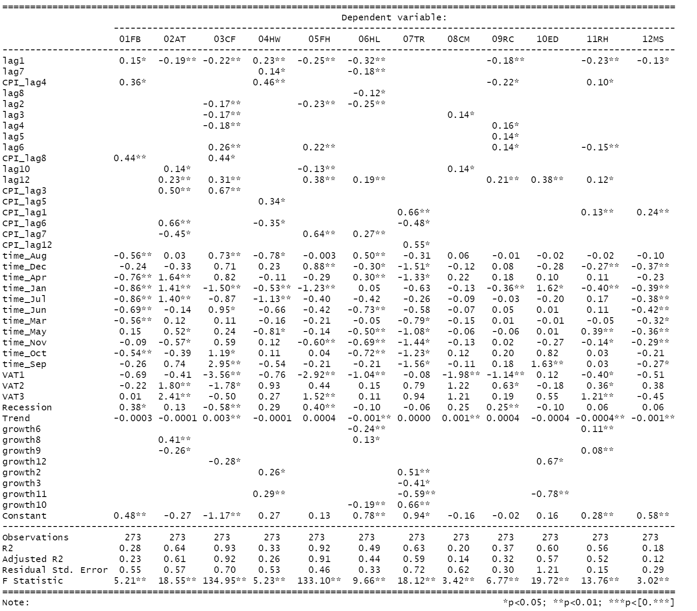
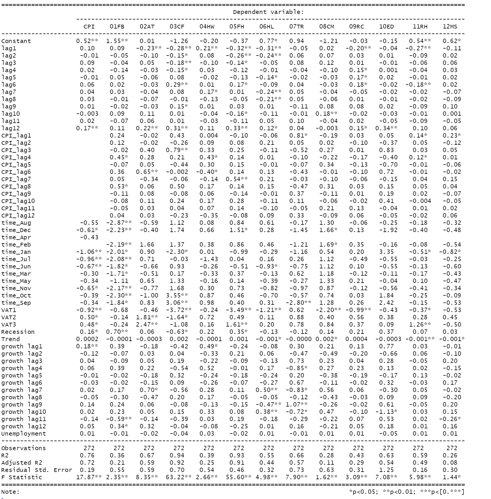

```{r setup, include=FALSE}
knitr::opts_chunk$set(echo = TRUE)
```

```{r rm, include=FALSE}
 rm(list = ls())
Sys.setlocale("LC_TIME", "English")
```

```{r Library, include=FALSE}
#Packages
library(readxl)
library(data.table)
library(lubridate)#extract cpi time to newdata(furniture48)
library(tidyverse) 
library(broom)
library(stargazer)
library(knitr)
library(officer)
library(flextable)
library(magrittr)
library(dplyr)
library(moments)
library(Inflation)
library(ggplot2)
library(zoo)
library(xts)
library(hydroTSM)
library(openair)
library(tibble)
library(miscTools)
library(priceR)
library(Metrics)
library(sjPlot)
library(sjmisc)
library(sjlabelled)
library(kableExtra)
library(gridExtra)
library(egg)
library(grid)
library(cowplot)
library(spatstat)#shift有重复
library(SciViews)
library(sos)
library(nowcasting)
```

```{r language,message=FALSE, warning=FALSE, include=FALSE, paged.print=FALSE}
Sys.setlocale("LC_TIME","English")
```

```{r , include=FALSE}
DF<-read_excel("consumption data.xlsx")
#分别生成
#jan,april,jul,oct
#96年q4*1/3+97年q1 * 2/3
third<-DF$`0`*1/3
san.fen.zhi.yi<-append(third,0,after = 0)
#
two<-DF$`0`*2/3
san.fen.zhi.2<-append(two,0,after = 99)
#
di.1.yue<-rowMeans(cbind(san.fen.zhi.2, san.fen.zhi.yi), na.rm=TRUE)

#去除最后一个数字 没用
di.1.yue <- head(di.1.yue,-1)
#第二个月
di.2.yue<-DF$`0`/2
#第三个月
#  1997年3月等于2/3* 97q1 +1/3 * 97q
#不需要q1的2/3
new.one<-third[-1]
new.two<-head(two,-1)
di.3.yue<-rowMeans(cbind(new.one,new.two),na.rm=TRUE)
di.3.yue<-append(di.3.yue,0,after = 98)
#交叉合并
ab <- as.vector(matrix(c(di.1.yue, di.2.yue,di.3.yue), nrow = 3, byrow = TRUE))
ab
#
smooth.data<-data.frame(matrix(nrow = 298,ncol = 2))
#date
smooth.data$date <-seq(from = as.Date("1997-01-01"), to = as.Date("2021-10-01"),
           by = "month")#生成日期
smooth.data$Total_expenditure<-c(ab,0)
fdf<-smooth.data[,-c(1:2)]
#write.csv(fdf,"smooth data for total expenditure.csv",row.names = FALSE)
fdf<-fdf[-c(297:298),]
```
# Process
According to your suggestion, I made quarterly into smoothed monthly data. The idea is I give Jan, April, July and Oct 1/3 weight of the previous quarter and 2/3 current quarter, sum up and divided by 2. 
Feb, May, August, Nov keep their quarter figures and divide by 2.
March, June, Sept and Dec have given 1/3 of the previous quarter and 2/3 current quarter, sum up and divided by 2. 


```{r , echo=FALSE, fig.cap="Total expenditure", fig.topcaption=TRUE, message=FALSE, warning=FALSE,results='asis'}
p<-ggplot(data=fdf, aes(x=date))+
 geom_line(aes(y =Total_expenditure, color="Total_expenditure")) +
labs(x="Time",y="millions pounds")
p
```
```{r echo=FALSE, message=FALSE, warning=FALSE, paged.print=FALSE}
library(tseries)
df.ts<-ts(fdf$Total_expenditure,frequency = 12,start = c(1997,1))
adf.test(df.ts)
```
# Augmented Dickey-Fuller Test

One way to test whether a time series is stationary is to perform an augmented Dickey-Fuller test, which uses the following null and alternative hypotheses:

H0: The time series is non-stationary. In other words, it has some time-dependent structure and does not have constant variance over time.

HA: The time series is stationary.

P-value: 0.1469

Since the p-value is  0.1469 not less than .05, we fail to reject the null hypothesis.

This means the time series is non-stationary. In other words, it has some time-dependent structure and does not have constant variance over time.

# Growh rate

Since total expenditure monthly data is not stationary, I try to convert to a percentage growth rate.

```{r growth rate, , include=FALSE}
library(dplyr)
growth_rate <- function(x)(x/lag(x)-1)*100 
fdf$growth_rate <- growth_rate(fdf$Total_expenditure) 
```

```{r echo=FALSE, message=FALSE, warning=FALSE, paged.print=FALSE}
library(tseries)
fdf<-fdf[-(1:2),]
df.ts<-ts(fdf$growth_rate,frequency = 12,start = c(1997,1))
adf.test(df.ts)
```

We examine the growth rate stationary by applying the ADF test. The p-value is 0.01; we reject the null hypothesis. This means the time series is stationary now. 

After we perform an augmented Dickey-Fuller test on the data, we can create a quick plot to visualize the data: There was a very clear fluctuation between March and August 2020.

```{r , echo=FALSE, fig.cap="Growth rate", fig.topcaption=TRUE, message=FALSE, warning=FALSE,results='asis'}
q<-ggplot(data=fdf, aes(x=date))+
 geom_line(aes(y =growth_rate, color="growth rate")) +
labs(x="Time",y="Growth rate percent change")
q
```


```{r message=FALSE, warning=FALSE, include=FALSE, paged.print=FALSE}
cpi <- read_excel("cpi data/cpi+division+group.xlsx")

setDF(cpi)#convert to 'data.frame'
#读取consumption growth rate 数据
raw_growth<-read.csv("monthly consumption data and growth rate 97.3 - 19.11.csv")
cpi$growth<-c(rep(0,110),raw_growth$growth_rate,rep(0,4)) 

#
cols.num <- c(colnames(cpi))
cpi[cols.num] <- sapply(cpi[cols.num],as.numeric)
#sapply(cpi,class)

cpi <- as.data.table(cpi)
colnames(cpi) = gsub("&", "and", colnames(cpi))
#class(cpi$`REPAIR OF HOUSEHOLD APPLIANCES1`)
COPY<-copy(cpi)
tracemem(COPY)==tracemem(cpi)


Data_A = as.data.table (cpi)
#


#
Varnames <- copy(names(Data_A))
Data_A[, (names(Data_A)) := lapply(.SD, as.numeric)][,
                                                     rn := .I]
melted <- melt(Data_A, id.vars="rn")[,
                                     (paste0("lag_", 0:12)) := data.table:: shift(value, 0:12, type="lag"),
                                     by=variable][, 
                                                  value:=NULL][]
res <- dcast.data.table(melt(melted, id.vars=c("rn", "variable"), variable.name="lag"),
                        rn ~ variable + lag, sum)

#view results
res[, ncol(res), with=FALSE]
# lagged variable generation ----------------------------------------------


cpi <- cpi[, unlist(lapply(.SD, data.table:: shift, n = 0:12), recursive = FALSE)]#lags generation


# Monthly Dummies ---------------------------------------------------------


cpi$time <- seq.Date(from = as.Date("1988/01/01",format = "%Y/%m/%d"), by = "month", length.out = 387)
cpi$time <- format(cpi$time, format = "%b")
Sys.setlocale("LC_TIME","English")
cpi <- fastDummies::dummy_cols(cpi, select_columns = "time", remove_most_frequent_dummy = TRUE,
)
cpi$time1 <- seq.Date(from = as.Date("1988/01/01",format = "%Y/%m/%d"), by = "month", length.out = 387)
#


# Extract time from 1993-2019 ---------------------------------------------


#I would recommend when you do the regressions, you leave out December 2019, because it is impacted by the Covid effect in 2020 Q1. Otherwise good to go!

newdata <- with(cpi, cpi[(time1) >= "1997-03-01" & (time1) <= "2019-11-01", ])

Trend <- seq_along(newdata$time1)


# deal with copy ----------------------------------------------------------


COPY$time1 <- seq.Date(from = as.Date("1988/01/01",format = "%Y/%m/%d"), by = "month", length.out = 387)
COPY <- with(COPY, COPY[(time1) >= "1997-03-01" & (time1) <= "2019-11-01", ])

COPY = subset(COPY, select = -c(time1) )
#lag
```


```{r Lag and VAT, include=FALSE}
old13<-c(2:13)
for (i in 1:12) {

  assign(paste0("lag",i),select(newdata,ends_with(paste0(old13[i]))))

}
lag1 <- lag1 %>% select(-contains("12"))
lag2 <- lag2 %>% select(-contains("13"))
VAT1 <- as.numeric(newdata$`time1` == "2008-12-01")
VAT2 <- as.numeric(newdata$`time1` == "2010-01-01")
VAT3 <- as.numeric(newdata$`time1` == "2011-01-01")
Recession <- as.numeric(newdata$`time1` >= "2008-04-01" & newdata$`time1`<= "2009-06-01")
```


```{r MONTYHLY DUMMIES, include=FALSE}
monthname<-c("time_Apr","time_Aug", "time_Dec",  "time_Jan","time_Jul","time_Jun" ,"time_Mar","time_May","time_Nov","time_Oct","time_Sep")
for (i in 1:length(monthname)) {
  print(
 which(colnames(newdata)==monthname[i])
)
}
```


```{r Create time_Apr etc., include=FALSE}
#the correct version. 首先把月度虚拟变量存储到cpilag 里.
#然后用同一迭代变量 送到各自的time_下. **注意, 双迭代变量还未完全掌握, i
#和j 一起用 必出错**
consumption<-newdata[,2250:2262]
monthdummies<-newdata[,2264:2274]

  for (i in 1:13) {
  assign(colnames(consumption)[i],as.numeric(unlist(consumption[[i]])))
  }


  for (i in 1:11) {
  assign(colnames(monthdummies)[i],as.numeric(unlist(monthdummies[[i]])))
  }


```

```{r simply lag and cpi, include=FALSE}

## CPI LDV variables position

lag.list <- mget(paste0("lag", 1:12))


for (i in 1:12) {
  assign(paste0("lag",i),as.data.frame(lag.list[[i]]))
}

COPY <- as.data.frame(COPY)


# CPI-LAGS ----------------------------------------------------------------
cpi.list<-c(paste0("CPI ALL ITEMS",2:13))

for (i in 1:length(cpi.list)) {
  print(which(colnames(newdata)==cpi.list[i]))
  
}   
cpilag<-newdata[,2:13]
for (i in 1:12) {

    
 
  assign(paste0("CPI_lag",i),as.numeric(unlist(cpilag[,..i])))
  
}


```


```{r Rgression, include=FALSE}
# Regression Equation -----------------------------------------------------


reg.model <- lapply(1:173, function(x) lm(COPY[,x] ~ lag1[,x]+lag2[,x]+lag3[,x]+lag4[,x]+
                                            lag5[,x]+lag6[,x]+lag7[,x]+lag8[,x]+lag9[,x]+
                                            lag10[,x]+lag11[,x]+lag12[,x]+ time_Aug + 
                                            time_Dec+ time_Apr+ time_Jan+time_Jul+time_Jun +
                                            time_Mar+time_May+time_Nov+time_Oct+time_Sep+VAT1+VAT2+VAT3+Recession+Trend+growth2+growth3+growth4+growth5+growth6+growth7+growth8+growth9+growth10+growth11+growth12+growth13)
)

for (i in 1:173) {
  names(reg.model[[i]]$coefficients)<-c('Constant','lag1','lag2',"lag3","lag4","lag5","lag6","lag7","lag8","lag9","lag10","lag11","lag12",
                                        "time_Aug" , 
                                        "time_Dec", "time_Feb", "time_Jan","time_Jul","time_Jun" ,"time_Mar",
                                        "time_May","time_Nov","time_Oct","time_Sep","VAT1","VAT2","VAT3","Recession","Trend")
}

regression <- lapply(1:122, function(x) lm(COPY[,x] ~ lag1[,x]+lag2[,x]+lag3[,x]+lag4[,x]+lag5[,x]+lag6[,x]+lag7[,x]+
                                             lag8[,x]+lag9[,x]+lag10[,x]+lag11[,x]+lag12[,x]+CPI_lag1+CPI_lag2+CPI_lag3+CPI_lag4+CPI_lag5+CPI_lag6+CPI_lag7+
                                             CPI_lag8+CPI_lag9+
                                             CPI_lag10+CPI_lag11+CPI_lag12+ time_Aug + 
                                             time_Dec+ time_Apr+ time_Jan+time_Jul+time_Jun +time_Mar+
                                             time_May+time_Nov+time_Oct+time_Sep+VAT1+VAT2+VAT3+Recession+Trend+growth2+growth3+growth4+growth5+growth6+growth7+growth8+growth9+growth10+growth11+growth12+growth13)
)
for (i in 1:122) {
  names(regression[[i]]$coefficients)<-c('Constant','lag1','lag2',"lag3","lag4","lag5","lag6","lag7","lag8","lag9","lag10","lag11","lag12",
                                         "CPI_lag1","CPI_lag2","CPI_lag3","CPI_lag4","CPI_lag5","CPI_lag6","CPI_lag7","CPI_lag8","CPI_lag9",
                                         "CPI_lag10","CPI_lag11","CPI_lag12","time_Aug" , 
                                         "time_Dec", "time_Feb", "time_Jan","time_Jul","time_Jun" ,"time_Mar",
                                         "time_May","time_Nov","time_Oct","time_Sep","VAT1","VAT2","VAT3","Recession","Trend",
                                         "growth lag1","growth lag2","growth lag3","growth lag4","growth lag5","growth lag6","growth lag7","growth lag8",
                                        "growth lag9","growth lag10","growth lag11","growth lag12")
}

```

```{r CPI, include=FALSE}
CPI_cosumption_reg<-lm(COPY[,1] ~ lag1[,1]+lag2[,1]+lag3[,1]+lag4[,1]+
                                            lag5[,1]+lag6[,1]+lag7[,1]+lag8[,1]+lag9[,1]+
                                            lag10[,1]+lag11[,1]+lag12[,1]+ time_Aug + 
                                            time_Dec+ time_Apr+ time_Jan+time_Jul+time_Jun +
                                            time_Mar+time_May+time_Nov+time_Oct+time_Sep+VAT1+VAT2+VAT3+Recession+Trend+growth2+growth3+growth4+growth5+growth6+growth7+growth8+growth9+growth10+growth11+growth12+growth13)
stargazer(CPI_cosumption_reg,
          star.cutoffs = c(0.05, 0.01),
          
          report = "vc*",
          align=TRUE,           
          header = FALSE,
          model.numbers=FALSE,
          column.labels = c(colnames(COPY[1])),
          df=FALSE, 
          digits=2, single.row = TRUE,
          summary=FALSE,
          se = NULL, type = "text")
```


```{r stargazer before simplify, include=FALSE}
CPI_cosumption_reg<-lm(COPY[,1] ~ lag1[,1]+lag2[,1]+lag3[,1]+lag4[,1]+
                                            lag5[,1]+lag6[,1]+lag7[,1]+lag8[,1]+lag9[,1]+
                                            lag10[,1]+lag11[,1]+lag12[,1]+ time_Aug + 
                                            time_Dec+ time_Apr+ time_Jan+time_Jul+time_Jun +
                                            time_Mar+time_May+time_Nov+time_Oct+time_Sep+VAT1+VAT2+VAT3+Recession+Trend+growth2+growth3+growth4+growth5+growth6+growth7+growth8+growth9+growth10+growth11+growth12+growth13)

CPI_cosumption_reg$coefficients

names(CPI_cosumption_reg$coefficients)<-c('Constant','lag1','lag2',"lag3","lag4","lag5","lag6","lag7","lag8","lag9","lag10","lag11","lag12",
                                        "time_Aug" ,"time_Dec", "time_Apr     ", "time_Jan","time_Jul","time_Jun" ,"time_Mar",
                                         "time_May","time_Nov","time_Oct","time_Sep","VAT1","VAT2","VAT3","Recession","Trend",
                                        "growth lag1","growth lag2","growth lag3","growth lag4","growth lag5","growth lag6","growth lag7","growth lag8",
                                        "growth lag9","growth lag10","growth lag11","growth lag12")
stargazer(CPI_cosumption_reg,
          star.cutoffs = c(0.05, 0.01),
          
          report = "vc*",
          align=TRUE,           
          header = FALSE,
          model.numbers=FALSE,
          column.labels = c(colnames(COPY[1])),
          df=FALSE, 
          digits=2, single.row = TRUE,
          summary=FALSE,
          se = NULL, type = "text")
```
# CPI all items level
## Model and data

The data set is monthly CPI all items and total expenditure for the UK from March 1997 to November 2019. We ignore the data after December 2019 since it is impacted by the Covid effect in 2020 Q1.

One of the significant  differences between this model and the previous one is that we use total consumption as the demand variable for the overall CPI rate. This model for monthly data not only assumes inflation depends on 12 lagged inflation, dummies variables of each month, three VAT change announcements, and the great $D_{recession}$, but also Consumption C.

$$
\begin{aligned}
	CPI _t=&Constant +\,\,\mathrm{Trend}_t+\beta _1D_{Jan}+....+\beta _{11}D_{Dec}+\beta _{12}D_{\mathrm{recesion}}+\\
	&\beta _{13}D_{VAT_1}+\beta _{14}D_{VAT_2}+\beta _{15}D_{TAT_3}+\sum_{j=1}^{12}{\alpha _j}C _{t-j}+\sum_{i=1}^{12}{\lambda _i}CPI_{t-i}+\sigma _t\\
\end{aligned}
$$
Where CPI is the inflation for CPI all itmes, $D_{JAN}$   to $D_{Dec}$   are eleven dummy variables for each month. We define February as the base category against which the others are assessed to avoid the dummy variable trap. $D_{recession}$  , the great recession that officially began in April 2008 and ended in June 2009, $D_{VAT_1}$ ,  $D_{VAT_2}$ and $D_{VAT_3}$    are three Value-add ed tax change in the United Kingdom, which were  December 2008, January 2010 and January 2011. $\sum_{j=1}^{12}{\alpha _j}C _{t-j}$    is the sum of 12 monthly lags consumption growth rate. $\sum_{i=1}^{12}{\lambda _i}CPI_{t-i}$ represents the sum of twelve months lags of the inflation rate of CPI ALL ITEMS. 


## Stepwise function

To further discover the independent variables that have a more significant influence on inflation and remove less critical coefficients, we introduce stepwise regression. In our simplified process, we apply backward elimination selection based on P-value criteria. For CPI all items, we go through a systematic procedure to simplify the lag structure: Omit the least significant independent variable and rerun until all variables are significant at 5% or 1%. In this process, we always leave the dummy variables in (VAT, monthly, crisis etc.) in regression, even if insignificant.
```{r include=FALSE}
# function ----------------------------------------------------------------


# Automated model selection
# Author      : Joris Meys
# version     : 0.2
# date        : 12/01/09

#CHANGE LOG
# 0.2   : check for empty scopevar vector

# #CHANGE LOG -------------------------------------------------------------


# Function has.interaction checks whether x is part of a term in terms
# terms is a vector with names of terms from a model
has.interaction <- function(x,terms){
  out <- sapply(terms,function(i){
    sum(1-(strsplit(x,":")[[1]] %in% strsplit(i,":")[[1]]))==0
  })
  return(sum(out)>0)
}

# Function Model.select
# model is the lm object of the full model
# keep is a list of model terms to keep in the model at all times
# sig gives the significance for removal of a variable. Can be 0.1 too (see SPSS)
# verbose=T gives the F-tests, dropped var and resulting model after 
model.select <- function(model,keep,sig=0.05,verbose=F){
  counter=1
  # check input
  if(!is(model,"lm")) stop(paste(deparse(substitute(model)),"is not an lm object\n"))
  # calculate scope for drop1 function
  terms <- attr(model$terms,"term.labels")
  if(missing(keep)){ # set scopevars to all terms
    scopevars <- terms
  } else{            # select the scopevars if keep is used
    index <- match(keep,terms)
    # check if all is specified correctly
    if(sum(is.na(index))>0){
      novar <- keep[is.na(index)]
      warning(paste(
        c(novar,"cannot be found in the model",
          "\nThese terms are ignored in the model selection."),
        collapse=" "))
      index <- as.vector(na.omit(index))
    }
    scopevars <- terms[-index]
  }
  
  # Backward model selection : 
  
  while(T){
    # extract the test statistics from drop.
    test <- drop1(model, scope=scopevars,test="F")
    
    if(verbose){
      cat("-------------STEP ",counter,"-------------\n",
          "The drop statistics : \n")
      print(test)
    }
    
    pval <- test[,dim(test)[2]]
    
    names(pval) <- rownames(test)
    pval <- sort(pval,decreasing=T)
    
    if(sum(is.na(pval))>0) stop(paste("Model",
                                      deparse(substitute(model)),"is invalid. Check if all coefficients are estimated."))
    
    # check if all significant
    if(pval[1]<sig) break # stops the loop if all remaining vars are sign.
    
    # select var to drop
    i=1
    while(T){
      dropvar <- names(pval)[i]
      check.terms <- terms[-match(dropvar,terms)]
      x <- has.interaction(dropvar,check.terms)
      if(x){i=i+1;next} else {break}              
    } # end while(T) drop var
    
    if(pval[i]<sig) break # stops the loop if var to remove is significant
    
    if(verbose){
      cat("\n--------\nTerm dropped in step",counter,":",dropvar,"\n--------\n\n")              
    }
    
    #update terms, scopevars and model
    scopevars <- scopevars[-match(dropvar,scopevars)]
    terms <- terms[-match(dropvar,terms)]
    
    formul <- as.formula(paste(".~.-",dropvar))
    model <- update(model,formul)
    
    if(length(scopevars)==0) {
      warning("All variables are thrown out of the model.\n",
              "No model could be specified.")
      return()
    }
    counter=counter+1
  } # end while(T) main loop
  return(model)
}

```

```{r keep critial, include=FALSE}

slr.total <- list()
keep.dummies <- c("time_Aug","time_Apr",
                  "time_Dec",  "time_Jan","time_Jul","time_Jun" ,"time_Mar","time_May","time_Nov","time_Oct","time_Sep",
                  "VAT1","VAT2","VAT3","Recession","Trend")

  slr.total <- model.select(CPI_cosumption_reg, keep = keep.dummies, sig = 0.05, verbose = F)


#**slr.total 60 REPAIR OF AUDIO-VISUAL & RELATED PRODUCTS
# 是空集, 84 left**

#去除空集

#替换名称
search_for_these <- c("lag1[, x]","lag2[, x]","lag3[, x]","lag4[, x]","lag5[, x]","lag6[, x]","lag7[, x]","lag8[, x]","lag9[, x]","lag10[, x]","lag11[, x]","lag12[, x]")
 replace_with_these <- c("lag1","lag2","lag3","lag4","lag5","lag6","lag7","lag8","lag9","lag10","lag11","lag12")
 found<-list()
#for (i in 1:length(slr.total)) {
#  found[[i]] <- match(names(slr.total[[i]]$coefficients), search_for_these, nomatch = 0)
#  names(slr.total[[i]]$coefficients)[names(slr.total[[i]]$coefficients) %in% search_for_these] <- replace_with_these[found[[i]]]
#}
 found <- match(names(slr.total$coefficients), search_for_these, nomatch = 0)
 names(slr.total$coefficients)[names(slr.total$coefficients) %in% search_for_these] <- replace_with_these[found]
 
 slr.total$coefficients

names(slr.total$coefficients)<-c('Constant',"lag3","lag12",
                                        "time_Aug" ,"time_Dec", "time_Apr     ", "time_Jan","time_Jul","time_Jun" ,"time_Mar",
                                         "time_May","time_Nov","time_Oct","time_Sep","VAT1","VAT2","VAT3","Recession","Trend",
                                        "growth lag2","growth lag10","growth lag12")
```

## Results
### The original results
```{r echo=FALSE, message=FALSE, warning=FALSE}
stargazer(CPI_cosumption_reg,
          star.cutoffs = c(0.05, 0.01),
                    dep.var.labels.include = FALSE,

          report = "vc*",
          align=TRUE,           
          header = FALSE,
          model.numbers=FALSE,
          column.labels = c(colnames(COPY[1])),
          df=FALSE, 
          digits=2, single.row = TRUE,
          summary=FALSE,
          se = NULL, type = "text")
```

### The simplified result
```{r echo=FALSE, message=FALSE, warning=FALSE}
stargazer(slr.total,
          star.cutoffs = c(0.05, 0.01),
          
          report = "vc*",
          align=TRUE,           
          header = FALSE,
          model.numbers=FALSE,
          column.labels = c(colnames(COPY[1])),
          df=FALSE, 
          digits=2, single.row = TRUE,
          summary=FALSE,
          se = NULL, type = "text")
```
#### Conclusions

Comparing the results before and after simplification, we can see that after simplification, 2, 10 and 12 monthly lags  consumption growth variables are significant. However, before stepwise, the results show that only one monthly lag consumption out of 12 is significant.

#  Divisions level

Besides modelling CPI for all items and Consumption, we also try with the divisions level.

## Model


$$
\begin{aligned}
	\pi _t=&\pi +\,\,\mathrm{Trend}_t+\beta _1D_{Jan}+....+\beta _{11}D_{Dec}+\beta _{12}D_{\mathrm{recesion}}+\\
	&\beta _{13}D_{VAT_1}+\beta _{14}D_{VAT_2}+\beta _{15}D_{TAT_3}+\sum_{j=1}^{12}{\alpha _j}\pi _{t-j}+\sum_{i=1}^{12}{\lambda _i}CPI_{t-i}+\sum_{k=1}^{12}{\theta _k}C _{t-k}+\sigma _t\\
\end{aligned}
$$
Where $\pi$ is the inflation for each divisions, $D_{JAN}$   to $D_{Dec}$   are eleven dummy variables for each month. We define February as the base category against which the others are assessed to avoid the dummy variable trap. $D_{recession}$  , the great recession that officially began in April 2008 and ended in June 2009, $D_{VAT_1}$ ,  $D_{VAT_2}$ and $D_{VAT_3}$    are three Value-add ed tax change in the United Kingdom, which were  December 2008, January 2010 and January 2011. $\sum_{k=1}^{12}{\theta _k}C _{t-k}$    is the sum of 12 monthly lags consumption growth rate. $\sum_{i=1}^{12}{\lambda _i}CPI_{t-i}$ represents the sum of twelve months lags of the inflation rate of CPI ALL ITEMS and $\sum_{j=1}^{12}{\alpha _j}\pi _{t-j}$ is the sum of twelve months lagged inflation dependent variables.


```{r division 0.05, include=FALSE}
div.name<-c("FOOD AND NON-ALCOHOLIC BEVERAGES","ALCOHOLIC BEVERAGES AND TOBACCO","CLOTHING AND FOOTWEAR","HOUSING, WATER, ELELCTRICITY, GAS AND OTHER FUELS","FURNITURE, HOUSEHOLD EQUIPMENT AND MAINTENANCE","HEALTH","TRANSPORT","COMMUNICATION","RECREATION and CULTURE","EDUCATION","RESTAURANTS AND HOTELS","MISCELLANEOUS GOODS AND SERVICES")

#division 位置
div.poi<-vector()

for (i in 1:length(div.name)) {
  div.poi[i]<-  which(colnames(COPY)==div.name[i])
  
}

div.reg<-regression[div.poi]

slr.total <- list()
keep.dummies <- c("time_Aug","time_Apr",
                  "time_Dec",  "time_Jan","time_Jul","time_Jun" ,"time_Mar","time_May","time_Nov","time_Oct","time_Sep",
                  "VAT1","VAT2","VAT3","Recession","Trend")
for (i in 1:length(div.reg)) {
  slr.total[[i]] <- model.select(div.reg[[i]], keep = keep.dummies, sig = 0.05, verbose = F)
}


#**slr.total 60 REPAIR OF AUDIO-VISUAL & RELATED PRODUCTS
# 是空集, 84 left**

#去除空集

#替换名称
search_for_these <- c("lag1[, x]","lag2[, x]","lag3[, x]","lag4[, x]","lag5[, x]","lag6[, x]","lag7[, x]","lag8[, x]","lag9[, x]","lag10[, x]","lag11[, x]","lag12[, x]")
 replace_with_these <- c("lag1","lag2","lag3","lag4","lag5","lag6","lag7","lag8","lag9","lag10","lag11","lag12")
 found<-list()
for (i in 1:length(slr.total)) {
  found[[i]] <- match(names(slr.total[[i]]$coefficients), search_for_these, nomatch = 0)
  names(slr.total[[i]]$coefficients)[names(slr.total[[i]]$coefficients) %in% search_for_these] <- replace_with_these[found[[i]]]
}


#names(slr.total$coefficients)<-c('Constant',"lag3","lag12",
#                                        "time_Aug" ,"time_Dec", "time_Apr     ", "time_Jan","time_Jul","time_Jun" ,"time_Mar",
#                                         "time_May","time_Nov","time_Oct","time_Sep","VAT1","VAT2","VAT3","Recession","Trend",
#                                        "growth lag2","growth lag10","growth lag12")
```
## Output
Please see Table \@ref(fig:bar).


```{r message=FALSE, include=FALSE, results='asis'}
library(stargazer)
abr.div.name<-c("01FB",	"02AT",	"03CF",	"04HW",	"05FH",	"06HL",	"07TR",	"08CM",	"09RC",	"10ED",	"11RH",	"12MS")
stargazer(slr.total,
          star.cutoffs = c(0.05, 0.01),
          dep.var.labels.include = FALSE,
          report = "vc*",
          align=TRUE,           
          header = FALSE,
          model.numbers=FALSE,
          column.labels = c(abr.div.name),
          df=FALSE, 
          digits=2, single.row = TRUE,
          summary=FALSE,
          se = NULL, type = "text")

```

\newpage

## Conclusions

From divisions stepwise results, we can see that all consumption lags of output in 01FB, 05FH, 08CM, 09RC and 12MS is insignificant.

\newpage

# Unemployment

## Data and methods

The data will be obtained from the ONS website of “Unemployment rate (aged 16 and over, seasonally adjusted)” in the Labor market statistics. To better examine how the unemployment rate affects monthly inflation, we turn the raw monthly unemployment data into monthly unemployment growth rates.

Then we add the unemployment rate to the equation, and we repeat the process.


$$
\begin{aligned}
	\pi _t=&\pi +\,\,\mathrm{Trend}_t+\beta _1D_{Jan}+....+\beta _{11}D_{Dec}+\beta _{12}D_{\mathrm{recesion}}+\\
	&\beta _{13}D_{VAT_1}+\beta _{14}D_{VAT_2}+\beta _{15}D_{TAT_3}+\beta_{16}U_t+\sum_{j=1}^{12}{\alpha _j}\pi _{t-j}+\sum_{i=1}^{12}{\lambda _i}CPI_{t-i}+\sum_{k=1}^{12}{\theta _k}C _{t-k}+\sigma _t\\
\end{aligned}
$$
```{r Unemployment,include=FALSE}
u_rate<-read_excel("unemployment rate 97.3-19.11.xlsx")
Unemployment<-u_rate$`Unemployment rate`
```

The values of unemployment and inflation are entered into figure \@ref(fig:acd), which shows their development in the period from 01.03.1997 to 01.11.2019.

```{r acd, echo=FALSE, fig.cap="Unemployment and inflation", fig.topcaption=TRUE, message=FALSE, warning=FALSE,results='asis'}
u_i<-newdata[,1]
u_i$time<-newdata$time1
u_i$unemployment<-Unemployment
colnames(u_i)[1]<-c("Inflation")

#growth 
u_i[,3] <- growth_rate(u_i[,3]) 
Unemployment<-u_i$unemployment
#
q<-ggplot(data=u_i, aes(x=time))+
 geom_line(aes(y =unemployment, color="Unmployment rate")) +
   geom_line(aes(y =Inflation, color="Inflation(Monthly)")) +
labs(x="Time",y= "percent change")
q
```

```{r CPI-unemployment, include=FALSE}
CPI_cosumption_unemploy<-lm(COPY[,1] ~ lag1[,1]+lag2[,1]+lag3[,1]+lag4[,1]+
                                            lag5[,1]+lag6[,1]+lag7[,1]+lag8[,1]+lag9[,1]+
                                            lag10[,1]+lag11[,1]+lag12[,1]+ time_Aug + 
                                            time_Dec+ time_Apr+ time_Jan+time_Jul+time_Jun +
                                            time_Mar+time_May+time_Nov+time_Oct+time_Sep+VAT1+VAT2+VAT3+Recession+Trend+growth2+growth3+growth4+growth5+growth6+growth7+growth8+growth9+growth10+growth11+growth12+growth13+Unemployment)

CPI_cosumption_unemploy$coefficients

names(CPI_cosumption_unemploy$coefficients)<-c('Constant','lag1','lag2',"lag3","lag4","lag5","lag6","lag7","lag8","lag9","lag10","lag11","lag12",
                                        "time_Aug" ,"time_Dec", "time_Apr ", "time_Jan","time_Jul","time_Jun" ,"time_Mar",
                                         "time_May","time_Nov","time_Oct","time_Sep","VAT1","VAT2","VAT3","Recession","Trend",
                                        "growth lag1","growth lag2","growth lag3","growth lag4","growth lag5","growth lag6","growth lag7","growth lag8",
                                        "growth lag9","growth lag10","growth lag11","growth lag12","Unemployment")
```


```{r CPI-unemployment output, eval=FALSE, include=FALSE}
stargazer(CPI_cosumption_unemploy,
          star.cutoffs = c(0.05, 0.01),
                    dep.var.labels.include = FALSE,

          report = "vc*",
          align=TRUE,           
          header = FALSE,
          model.numbers=FALSE,
          column.labels = c(colnames(COPY[1])),
          df=FALSE, 
          digits=2, single.row = TRUE,
          summary=FALSE,
          se = NULL, type = "text")
```

```{r DIvision-unemployment, include=FALSE}
regression <- lapply(1:122, function(x) lm(COPY[,x] ~ lag1[,x]+lag2[,x]+lag3[,x]+lag4[,x]+lag5[,x]+lag6[,x]+lag7[,x]+
                                             lag8[,x]+lag9[,x]+lag10[,x]+lag11[,x]+lag12[,x]+CPI_lag1+CPI_lag2+CPI_lag3+CPI_lag4+CPI_lag5+CPI_lag6+CPI_lag7+
                                             CPI_lag8+CPI_lag9+
                                             CPI_lag10+CPI_lag11+CPI_lag12+ time_Aug + 
                                             time_Dec+ time_Apr+ time_Jan+time_Jul+time_Jun +time_Mar+
                                             time_May+time_Nov+time_Oct+time_Sep+VAT1+VAT2+VAT3+Recession+Trend+growth2+growth3+growth4+growth5+growth6+growth7+growth8+growth9+growth10+growth11+growth12+growth13+Unemployment)
)
for (i in 1:122) {
  names(regression[[i]]$coefficients)<-c('Constant','lag1','lag2',"lag3","lag4","lag5","lag6","lag7","lag8","lag9","lag10","lag11","lag12",
                                         "CPI_lag1","CPI_lag2","CPI_lag3","CPI_lag4","CPI_lag5","CPI_lag6","CPI_lag7","CPI_lag8","CPI_lag9",
                                         "CPI_lag10","CPI_lag11","CPI_lag12","time_Aug" , 
                                         "time_Dec", "time_Feb", "time_Jan","time_Jul","time_Jun" ,"time_Mar",
                                         "time_May","time_Nov","time_Oct","time_Sep","VAT1","VAT2","VAT3","Recession","Trend",
                                         "growth lag1","growth lag2","growth lag3","growth lag4","growth lag5","growth lag6","growth lag7","growth lag8",
                                        "growth lag9","growth lag10","growth lag11","growth lag12","Unemployment")
}

slr.total <- list()
keep.dummies <- c("time_Aug","time_Apr",
                  "time_Dec",  "time_Jan","time_Jul","time_Jun" ,"time_Mar","time_May","time_Nov","time_Oct","time_Sep",
                  "VAT1","VAT2","VAT3","Recession","Trend")
for (i in 1:length(div.reg)) {
  slr.total[[i]] <- model.select(div.reg[[i]], keep = keep.dummies, sig = 0.05, verbose = F)
}


#替换名称
search_for_these <- c("lag1[, x]","lag2[, x]","lag3[, x]","lag4[, x]","lag5[, x]","lag6[, x]","lag7[, x]","lag8[, x]","lag9[, x]","lag10[, x]","lag11[, x]","lag12[, x]")
 replace_with_these <- c("lag1","lag2","lag3","lag4","lag5","lag6","lag7","lag8","lag9","lag10","lag11","lag12")
 found<-list()
for (i in 1:length(slr.total)) {
  found[[i]] <- match(names(slr.total[[i]]$coefficients), search_for_these, nomatch = 0)
  names(slr.total[[i]]$coefficients)[names(slr.total[[i]]$coefficients) %in% search_for_these] <- replace_with_these[found[[i]]]
}
```

```{r message=FALSE, include=FALSE, results='asis'}
library(stargazer)
abr.div.name<-c("01FB",	"02AT",	"03CF",	"04HW",	"05FH",	"06HL",	"07TR",	"08CM",	"09RC",	"10ED",	"11RH",	"12MS")
stargazer(slr.total,
          star.cutoffs = c(0.05, 0.01),
          dep.var.labels.include = FALSE,
          report = "vc*",
          align=TRUE,           
          header = FALSE,
          model.numbers=FALSE,
          column.labels = c(abr.div.name),
          df=FALSE, 
          digits=2, single.row = TRUE,
          summary=FALSE,
          se = NULL, type = "text")

```

```{r message=FALSE, include=FALSE, results='asis'}
library(stargazer)
#division 位置
div.poi<-vector()

for (i in 1:length(div.name)) {
  div.poi[i]<-  which(colnames(COPY)==div.name[i])
  
}

div.reg<-regression[div.poi]

abr.div.name<-c("01FB",	"02AT",	"03CF",	"04HW",	"05FH",	"06HL",	"07TR",	"08CM",	"09RC",	"10ED",	"11RH",	"12MS")
stargazer(CPI_cosumption_unemploy,div.reg,
          star.cutoffs = c(0.05, 0.01),
          dep.var.labels.include = FALSE,
          report = "vc*",
          align=TRUE,           
          header = FALSE,
          model.numbers=FALSE,
          column.labels = c("CPI",abr.div.name),
          df=FALSE, 
          digits=2, single.row = TRUE,
          summary=FALSE,
          se = NULL, type = "text")

```

## Regression output

The results are in Table \@ref(fig:bar2). As we can see, The unemployment change rate is not significant for the 12 divisions and aggregate CPI.



## Some more lags of unemployment 

### Model

Since unemployment is not significant for division and aggreagte CPI, we  try 12 more lags of unemployment. 

$$
\begin{aligned}
	\pi _t=&\pi +\,\,\mathrm{Trend}_t+\beta _1D_{Jan}+....+\beta _{11}D_{Dec}+\beta _{12}D_{\mathrm{recesion}}+\\
	&\beta _{13}D_{VAT_1}+\beta _{14}D_{VAT_2}+\beta _{15}D_{TAT_3}+\sum_{h=1}^{12}{\psi _i}U_{t-h}+\sum_{j=1}^{12}{\alpha _j}\pi _{t-j}+\sum_{i=1}^{12}{\lambda _i}CPI_{t-i}+\sum_{k=1}^{12}{\theta _k}C _{t-k}+\sigma _t\\
\end{aligned}
$$


