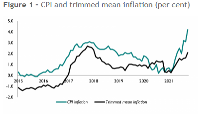

```{r setup, include=FALSE}
knitr::opts_chunk$set(echo = TRUE)
```

```{r include=FALSE}
 rm(list = ls())
Sys.setlocale("LC_TIME", "English")
```

```{r Library, include=FALSE}
library(readxl)
library(data.table)
library(lubridate)#extract cpi time to newdata(furniture48)
library(dplyr) 
library(tidyverse) 
library(broom)
library(stargazer)
library(knitr)
library(officer)
library(flextable)
library(magrittr)
library(dplyr)
library(moments)
library(Inflation)
library(ggplot2)
library(zoo)
library(xts)
library(hydroTSM)
library(openair)
```

```{r message=FALSE, warning=FALSE, include=FALSE, paged.print=FALSE}
Sys.setlocale("LC_TIME","English")
```

# DATA

At first I wanted the same length of data as the first part of the
thesis, with data from 1993-2019. Due to miss data for CPI weights
1997-2004. I can only find CPI weights cover 1988-1996 and 2005-2019. So
the computation of the trimmed means core inflation I start from
2005-2019.

In addition, I also tried to be consistent with the previous data in
terms of frequency, but I could only find annual data for our 85 classes
from 2005-2019. Accordingly, I have replaced the monthly CPI data with
annual CPI data, in order to match the weighting data.

## CPI weights

The data I have organized into spreadsheet, please see CPI weight.csv.

```{r include=FALSE}
w1<-read_excel("2005-2019 cpi weight 85.xlsx",sheet = "Sheet2")
w1 <- na.omit(w1)#删除空白行
w2<-read_excel("2005-2019 cpi weight 85.xlsx")#获取85class名字的df
length(which(w1$...1 %in% w2$combname==TRUE))#相同名字的class的长度 =85个
wp<-which(w1$...1 %in% w2$combname==TRUE)   #保存85class 行的位置
aaa<-w1[wp,]#remove ireelevent and done
bbb<-aaa[,-1]
df2 <- data.frame(t(bbb))
colnames(df2) <- aaa$...1
df2[] <- lapply(df2, function(x) as.numeric(as.character(x)))
sapply(df2,class)
df2<-df2/10
w.ts<-ts(df2,start = c(2005),frequency = 1)
write.csv(df2,file = "CPI weight.csv")

```

## CPI COICOP index

The data I have organized into spreadsheet, please see CPI COICOP
index.csv.

```{r include=FALSE}
df<-read_excel("85 cpi idex dat.xlsx",sheet="Sheet1")#读取85部门cpi 数据
#有些列不是numerical，
df[] <- lapply(df, function(x) as.numeric(as.character(x)))
#把所有cpi index 转化为增长率
df<-as.data.table(df)[, lapply(.SD, function(x)x/shift(x) - 1), .SDcols = 1:ncol(df)]
#不会在function里×100 只能笨办法了
df<-df*100
#检查各列属性
sapply(df, class)
date = seq(from = as.Date("1988-01-01"), to = as.Date("2019-12-01"),
           by = "month")#生成日期
zxc <- data.frame(date, df)#合并日期和原数据到新df
#只保留2005年之后的
qwe<-zxc[zxc$date>="2005-01-01",]#这部分数据和read to work.csv 里是完全一样的，也就是和我的病历本 得inflation计算结果是相同的. 证明都没错。

## annual mean
zzz <- timeAverage(qwe, avg.time = "year")
write.csv(zzz,file = "CPI COICOP Index.csv")
zzz<-zzz[,-1]

#转化成从2005年开始的年度ts 数据类型
ix.ts<-ts(zzz,start = c(2005),frequency = 1,names = c(aaa$...1) )

```

```{r include=FALSE}
#run core inflation
cf<-INFL.core_tm(subits.var = ix.ts,weights = w.ts)
nt<-ts(cf$core,start = c(2005),frequency = 1,names = c(aaa$...1) )
```

# Computes the trimmed means core inflation

Trimming mean requires sorting the CPI indices by trimming the tails of
the sample distribution, i.e., the overly volatile part of the indices,
and then averaging the remainder. The data of 85 classes are sorted
$\left\{x_{1}, \ldots, x_{n}\right\}$ and the corresponding weights are
sorted in the same
way.$\left\{\boldsymbol{w}_{1}, \ldots, \boldsymbol{w}_{n}\right\}$.
Define cumulative weights as $W i$, i.e.
$\boldsymbol{W} \boldsymbol{i} \equiv \sum_{j=1}^{i} \boldsymbol{w}_{j}$
, $\alpha / 100<W_{i}<(1-\alpha / 100)$. The formula is:

$\bar{x}_{\alpha}=\frac{1}{1-2 \alpha / 100} \sum_{i \in I_{\alpha}} w_{i} x_{i}$

Percentage lower and upper tail cut defined as 20%.

## Plot

```{r include=FALSE}
#把真实cpi 和core 放到一个df里 ggplot
ccc<-data.frame(matrix(nrow = length(cf$core),ncol = 2))
#两列，一列core 一列cpi
colnames(ccc)<-c("core","cpi")
#
cpi05<-read_excel("annual cpi.xls")
s<-which(cpi05[,1]=="2005")
e<-which(cpi05[,1]=="2019")
ddd<-cpi05[s:e,]


ccc$core<-cf$core
ccc$cpi<-ddd$`CPI ANNUAL RATE 00: ALL ITEMS 2015=100`
#有些列不是numerical，
ccc[] <- lapply(ccc, function(x) as.numeric(as.character(x)))
#ggplot
p<-ggplot(data=ccc, aes(x=time(nt)))+
 geom_line(aes(y = core,color = "Trimmed mean Inflation") )+ 
geom_line(aes(y = cpi, color="CPI Inflation")) +
labs(x="Time",y="Inflation")
  

```

```{r  echo=FALSE, fig.cap = "85 classes CPI and Trimmed Mean core inflation.",fig.topcaption=TRUE}
p + theme(legend.title = element_blank()) 
```

# 



# Conclusion

The figure 1 is Trimmed mean inflation published by National Institute
of Economic and Social Research, In contrast, core inflation in the 85
classes appears to be more stable.
